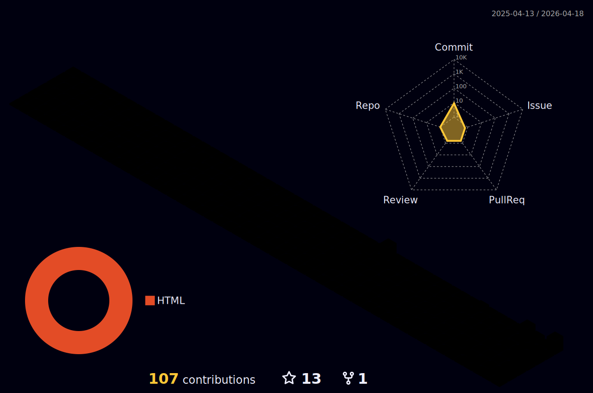

<h1 align="center">Olá, eu sou o Dérick. Seja bem vindo(a)!  😀</h1>

 

# Minhas Habilidades

# Minhas estatísticas do GitHub

### GitHub Streak

### Gráfico de atividades do GitHub

# Principais Projetos

